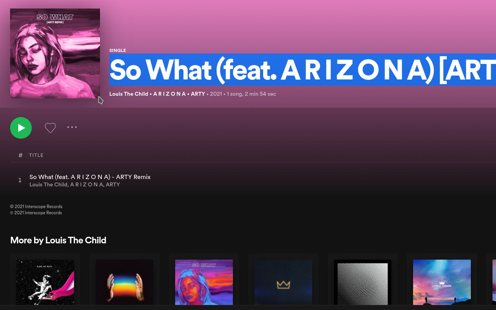

  

<h1 align="center">select-spotify</h1>

A web extension that makes song/album/playlist titles selectable on Spotify web. (open.spotify.com)

## Why?
Have you ever wanted to copy a song title from Spotify to send to a friend? Me too. Maybe this friend doesn't have Spotify, or maybe you want to find the music video on YouTube. There is currently no way to select and copy a song/album title, which is especially inconvenient when trying to search for a song in a foreign language you can't speak. This small extension makes some CSS changes on Spotify (web only) to allow users to copy titles from album/playlist header and the tracklist.

## Planned Features
- Enable/Disable
- Choose which parts of the UI are select-able

## Screenshots

  

## Browser Support

   49 & later ✔

   52 & later ✔

## 🚀 Quick Start

Ensure you have

- [Node.js](https://nodejs.org) 10 or later installed
- [Yarn](https://yarnpkg.com) v1 or v2 installed

Then run the following:

- `yarn install` to install dependencies.
- `yarn run dev:chrome` to start the development server for chrome extension
- `yarn run dev:firefox` to start the development server for firefox addon
- `yarn run dev:opera` to start the development server for opera extension
- `yarn run build:chrome` to build chrome extension
- `yarn run build:firefox` to build firefox addon
- `yarn run build:opera` to build opera extension
- `yarn run build` builds and packs extensions all at once to extension/ directory

### Development

- `yarn install` to install dependencies.
- To watch file changes in developement

  - Chrome
    - `yarn run dev:chrome`
  - Firefox
    - `yarn run dev:firefox`
  - Opera
    - `yarn run dev:opera`

- **Load extension in browser**

- ### Chrome

  - Go to the browser address bar and type `chrome://extensions`
  - Check the `Developer Mode` button to enable it.
  - Click on the `Load Unpacked Extension…` button.
  - Select your extension’s extracted directory.

- ### Firefox

  - Load the Add-on via `about:debugging` as temporary Add-on.
  - Choose the `manifest.json` file in the extracted directory

- ### Opera

  - Load the extension via `opera:extensions`
  - Check the `Developer Mode` and load as unpacked from extension’s extracted directory.

### Production

- `yarn run build` builds the extension for all the browsers to `extension/BROWSER` directory respectively.

## Bugs

Please file an issue [here](https://github.com/kholland950/select-spotify/issues/new) for bugs, missing documentation, or unexpected behavior.

### Linting Config

- Shared Eslint & Prettier Configuration - [`@abhijithvijayan/eslint-config`](https://www.npmjs.com/package/@abhijithvijayan/eslint-config)

## License

MIT © [Kevin Holland](https://kevinholland.me)
